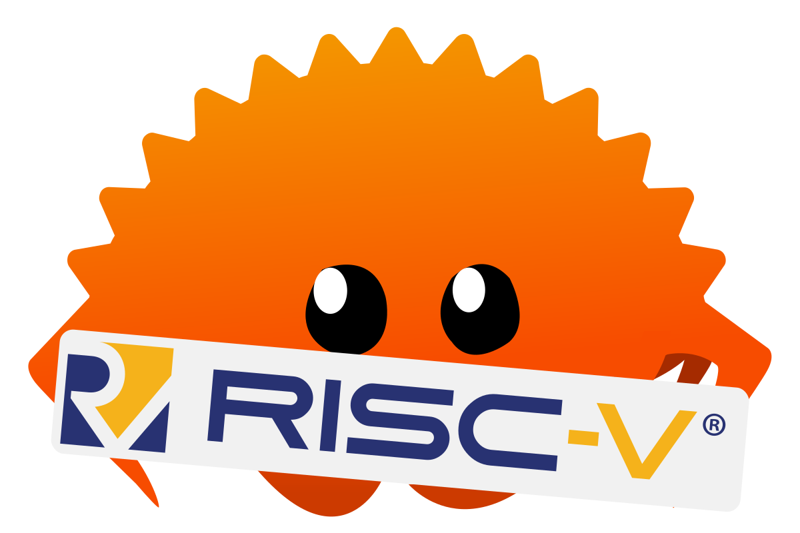

<h1 align="center">Riscvonomicon</h1>
<h4 align="center">A reference book for using RISC-V in Rust</h4>

    

This is the source for [this book][book-url]. This book provides useful
information for using the [RISC-V] instruction set in the [Rust] programming
language.

## Goal

The riscvonomicon book focusses on the practical programming aspects of using
[RISC-V]. Specifically, the book illustrates these aspects through the [Rust
programming language][Rust] ecosystem. However, many of the concepts discussed
in the book are language agnostic.

## Contents

This book contains:

* Utilizing Rust and RISC-V specific crates, tools and environments
* Building, testing, fuzzing and formally verify code for RISC-V written in Rust
* Utilizing RISC-V instructions, intrinsics and extensions in Rust

## License

Licensed under both a [MIT](./LICENSE-MIT) and [Apache-2.0](./LICENSE-APACHE)
license.

[book-url]: https://riscvonomicon.github.io/book
[RISC-V]: https://en.wikipedia.org/wiki/RISC-V
[Rust]: https://en.wikipedia.org/wiki/Rust_(programming_language)